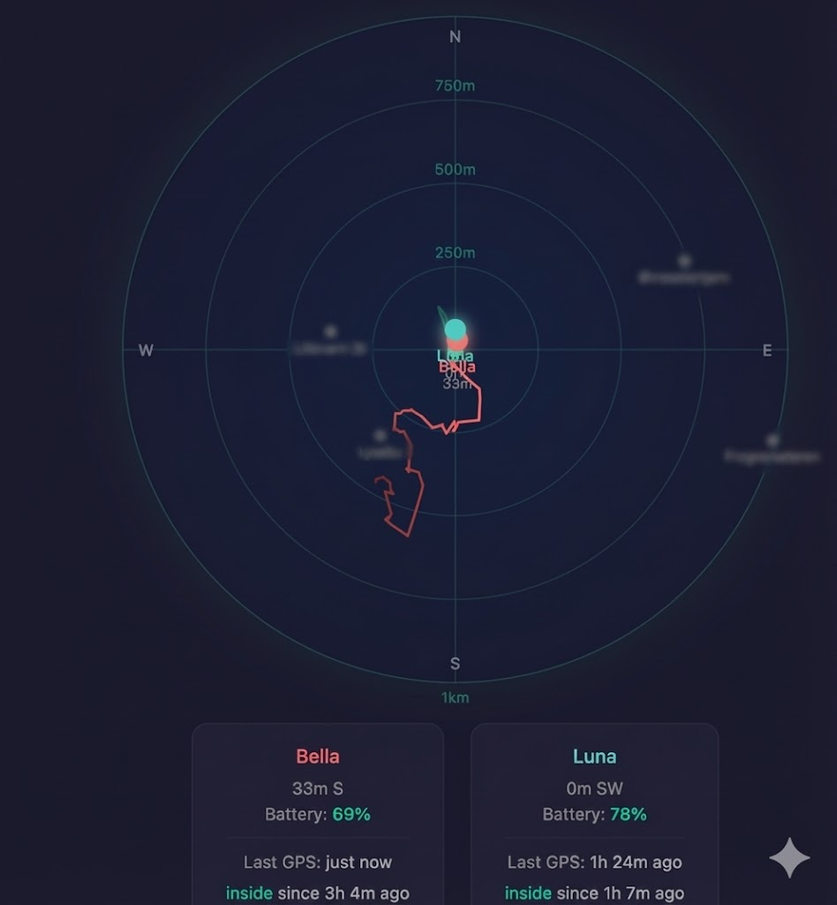
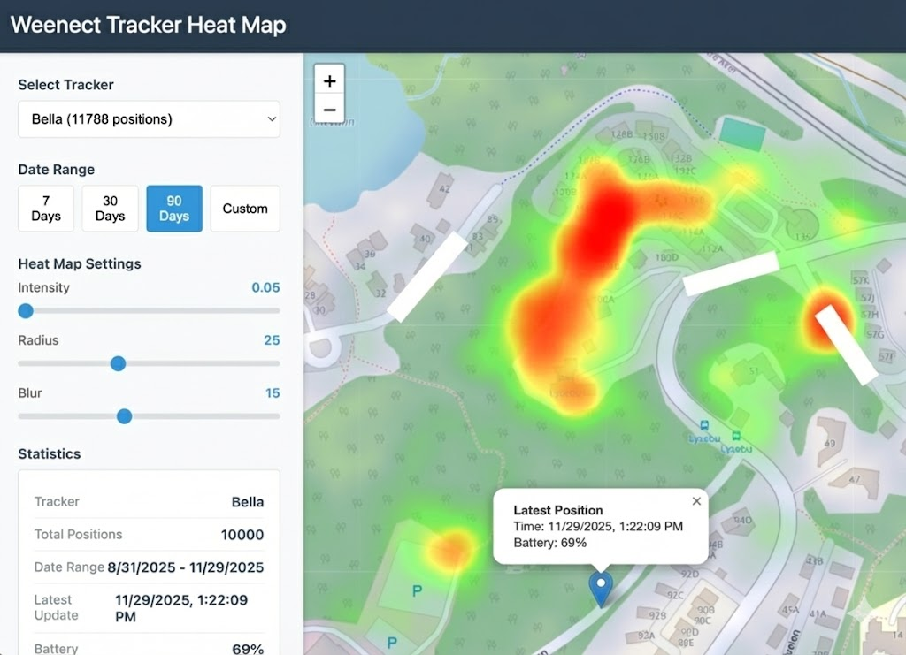

# Catboard 2000

A daemon that automatically syncs GPS position data from Weenect trackers to a local SQLite database.

This is not meant to be generally useful, but rather a personal project to figure out where my cats are.




## Features

- **Scheduled Syncing**: Runs on a configurable schedule (default: nightly at 2am)
- **Rate Limiting**: Respects API rate limits (default: 4 requests/second)
- **Idempotent**: Re-running syncs won't create duplicate records
- **Resumable**: Tracks last sync time per tracker for incremental syncs
- **Backfill Support**: Can fetch historical data before daemon was running
- **SQLite Storage**: Zero-config embedded database

## Installation

```bash
go install github.com/perbu/cat2k@latest
```

Or build from source:

```bash
go build -o cat2k
```

## Configuration

Configuration can be provided via (in order of priority):

1. Environment variables (highest priority)
2. Config file (JSON) - automatically searched in default locations
3. Command-line defaults

The daemon automatically looks for config files in these locations:

- `./config.json` (current directory)
- `./cat2k.json` (current directory)
- `~/.config/cat2k/config.json`
- `~/.cat2k/config.json`

You can override with `--config` flag if needed.

### Environment Variables

```bash
export WEENECT_USERNAME="your-username"
export WEENECT_PASSWORD="your-password"
export WEENECT_DATABASE_PATH="./catboard.db"
export WEENECT_RATE_LIMIT="4.0"
export WEENECT_BACKFILL_START_DATE="2024-01-01"
export WEENECT_SYNC_SCHEDULE="0 2 * * *"  # Cron format
export WEENECT_LOG_LEVEL="info"
```

### Config File

Copy `config.example.json` to one of the default locations (e.g., `./config.json`):

```json
{
  "username": "your-weenect-username",
  "password": "your-weenect-password",
  "database_path": "./catboard.db",
  "rate_limit": 4.0,
  "backfill_start_date": "2024-01-01",
  "sync_schedule": "0 2 * * *",
  "log_level": "info"
}
```

The daemon will automatically find and use it. If you need a custom location:

```bash
cat2k run --config /path/to/custom-config.json
```

### Cron Schedule Format

The sync schedule uses standard cron format:

```
 ┌───────────── minute (0 - 59)
 │ ┌───────────── hour (0 - 23)
 │ │ ┌───────────── day of month (1 - 31)
 │ │ │ ┌───────────── month (1 - 12)
 │ │ │ │ ┌───────────── day of week (0 - 6) (Sunday to Saturday)
 │ │ │ │ │
 * * * * *
```

Examples:

- `0 2 * * *` - Daily at 2am
- `0 */6 * * *` - Every 6 hours
- `30 8 * * 1-5` - 8:30am on weekdays
- `0 0 * * 0` - Weekly on Sunday at midnight

## Usage

### Start Daemon (Scheduled Syncs)

```bash
# Run daemon (uses config.json or env vars)
cat2k run

# Run with custom config location
cat2k run --config /path/to/config.json
```

The daemon will run continuously and sync according to the schedule.

### Manual Sync

```bash
# Sync all trackers now
cat2k sync-now

# Sync specific tracker
cat2k sync-now --tracker-id 12345
```

### Backfill Historical Data

```bash
# Backfill all trackers from a start date
cat2k backfill --start-date 2024-01-01

# Backfill with custom date range
cat2k backfill --start-date 2024-01-01 --end-date 2024-12-31

# Backfill specific tracker
cat2k backfill --start-date 2024-01-01 --tracker-id 12345
```

### View Status

```bash
cat2k status
```

Example output:

```
Catboard 2000 Status
====================

Database: ./catboard.db
Trackers: 2
Total Positions: 15432

Last Sync:
  Time: 2024-01-15T02:00:00Z
  Success: true
  Positions Fetched: 48
```

### View Statistics

```bash
# Stats for all trackers
cat2k stats

# Stats for specific tracker
cat2k stats --tracker-id 12345
```

Example output:

```
Statistics for All Trackers
===========================

Tracker: Dog Tracker (ID: 12345)
  Positions: 8432
  First Position: 2024-01-01T00:00:00Z
  Last Position: 2024-01-15T23:45:00Z
  Last Sync: 2024-01-15T02:00:00Z

Tracker: Cat Tracker (ID: 12346)
  Positions: 7000
  First Position: 2024-01-01T00:00:00Z
  Last Position: 2024-01-15T23:50:00Z
  Last Sync: 2024-01-15T02:00:00Z
```

## Database Schema

The daemon creates three tables:

### `trackers`

- `id` - Tracker ID (primary key)
- `name` - Tracker name
- `last_sync_timestamp` - Last successful sync time
- `created_at` - Record creation time
- `updated_at` - Record update time

### `positions`

- `id` - Position ID (primary key, from Weenect API)
- `tracker_id` - Foreign key to trackers
- `timestamp` - Position timestamp
- `latitude` / `longitude` - GPS coordinates
- `battery` - Battery level
- `speed` - Speed in m/s
- `direction` - Direction in degrees
- `valid_signal` - GPS signal validity
- `satellites` - Number of satellites
- `gsm` - GSM signal strength
- `type` - Position type
- `last_message` / `date_server` / `date_tracker` - Various timestamps
- `created_at` - Record creation time

### `sync_log`

- `id` - Log entry ID
- `tracker_id` - Tracker ID (null for full syncs)
- `sync_time` - Sync start time
- `positions_fetched` - Number of positions retrieved
- `start_date` / `end_date` - Date range synced
- `success` - Whether sync succeeded
- `error_message` - Error details if failed
- `duration_ms` - Sync duration in milliseconds

## Running as a Service

### systemd (Linux)

Create `/etc/systemd/system/cat2k.service`:

```ini
[Unit]
Description=Catboard 2000 GPS Data Collector
After=network.target

[Service]
Type=simple
User=your-user
WorkingDirectory=/path/to/daemon
Environment="WEENECT_USERNAME=your-username"
Environment="WEENECT_PASSWORD=your-password"
ExecStart=/path/to/cat2k run
Restart=on-failure
RestartSec=10

[Install]
WantedBy=multi-user.target
```

Then:

```bash
sudo systemctl daemon-reload
sudo systemctl enable cat2k
sudo systemctl start cat2k
sudo systemctl status cat2k
```

### launchd (macOS)

Create `~/Library/LaunchAgents/com.catboard2000.daemon.plist`:

```xml
<?xml version="1.0" encoding="UTF-8"?>
<!DOCTYPE plist PUBLIC "-//Apple//DTD PLIST 1.0//EN" "http://www.apple.com/DTDs/PropertyList-1.0.dtd">
<plist version="1.0">
    <dict>
        <key>Label</key>
        <string>com.catboard2000.daemon</string>
        <key>ProgramArguments</key>
        <array>
            <string>/path/to/cat2k</string>
            <string>run</string>
        </array>
        <key>EnvironmentVariables</key>
        <dict>
            <key>WEENECT_USERNAME</key>
            <string>your-username</string>
            <key>WEENECT_PASSWORD</key>
            <string>your-password</string>
        </dict>
        <key>RunAtLoad</key>
        <true/>
        <key>KeepAlive</key>
        <true/>
        <key>StandardOutPath</key>
        <string>/tmp/cat2k.log</string>
        <key>StandardErrorPath</key>
        <string>/tmp/cat2k.error.log</string>
    </dict>
</plist>
```

Then:

```bash
launchctl load ~/Library/LaunchAgents/com.catboard2000.daemon.plist
launchctl start com.catboard2000.daemon
```

## Querying the Database

You can query the SQLite database directly:

```bash
sqlite3 catboard.db

# Get all trackers
SELECT * FROM trackers;

# Get recent positions
SELECT * FROM positions ORDER BY timestamp DESC LIMIT 10;

# Get positions for specific tracker
SELECT * FROM positions WHERE tracker_id = 12345 ORDER BY timestamp DESC;

# Get sync history
SELECT * FROM sync_log ORDER BY sync_time DESC LIMIT 10;
```

## Troubleshooting

### Check Logs

```bash
# View daemon logs (systemd)
sudo journalctl -u cat2k -f

# View daemon logs (launchd)
tail -f /tmp/cat2k.log
```

### Enable Debug Logging

Set `log_level` to `debug` in config or:

```bash
export WEENECT_LOG_LEVEL="debug"
```

Debug logging includes:

- All API requests (login, get trackers, get positions) with parameters
- API responses with result counts
- Rate limiter activity (when requests are delayed)
- 24-hour chunking details for large date ranges

### Common Issues

**Authentication Errors**: Verify username and password are correct

```bash
cat2k sync-now  # Will show auth errors immediately
```

**Rate Limiting**: Reduce `rate_limit` if seeing errors

```bash
export WEENECT_RATE_LIMIT="2.0"  # Slower but safer
```

**Database Locked**: Only one daemon instance should run at a time

## License

Same license as the parent project (see repository root)
